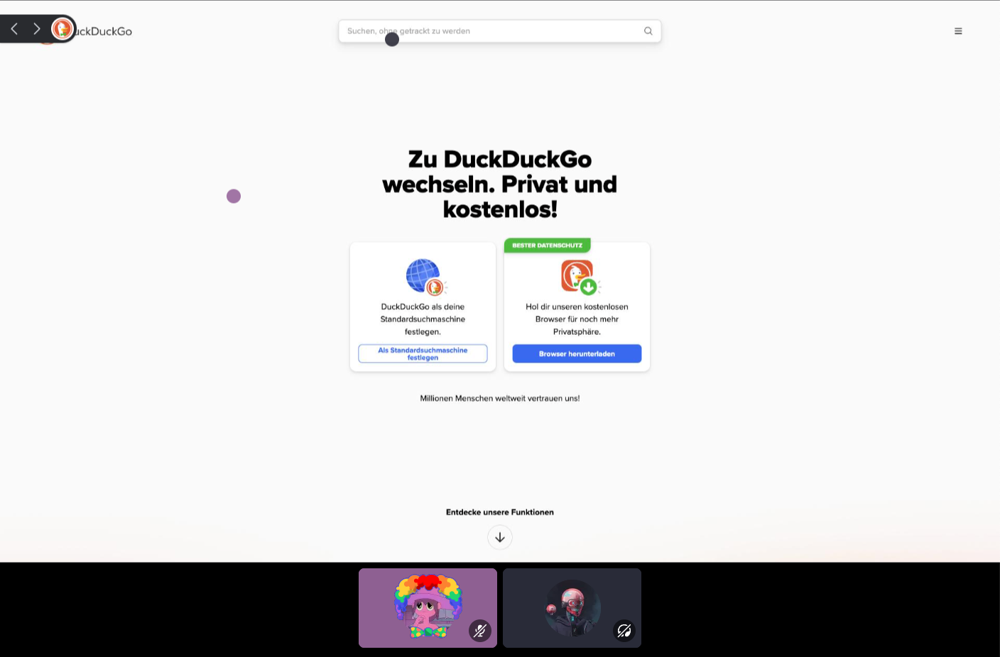

# Browse Together

Browse the web together with your friends on Discord powered by the [Embedded App SDK](https://github.com/discord/embedded-app-sdk).



## Progress

- [x] Shared browser instances
- [x] Stream browser with static frame rate
- [x] Support for mouse and keyboard
- [x] URL navigation
- [ ] Adaptive frame rate based on content
- [ ] Stop browser from randomly crashing

## Local Installation

### Run Server

```shell
export DISCORD_CLIENT_ID=<your_client_id>
export DISCORD_CLIENT_SECRET=<your_client_secret>

cd server
yarn
npx @puppeteer/browsers install chrome@stable
yarn dev
```

### Run Client

```shell
export VITE_DISCORD_CLIENT_ID=<your_client_id>
export VITE_WS_URL=wss://<your_client_id>.discordsays.com/ws

cd client
yarn
yarn dev
```

### Expose to the internet

Discord must be able to connect to our server and client over HTTPS. For this we expose both services using the [Cloudflare Tunnel Client](https://github.com/cloudflare/cloudflared). You don't need a Cloudflare account for this.

Cloudflare will give you a random unique URL for each service.

```shell
# For the client
cloudflared tunnel --url http://localhost:3000

# For the server
cloudflared tunnel --url http://localhost:8080
```

### Configure Discord App

Go to the [Discord Developer Portal](https://discor.dev) and select your app. Go to "Activities", enable it, and then go to "URL Mappings".

Here enter the URL Cloudflare has given you for the client as the "Root Mapping" and the URL Cloudflare has given you for the server with the prefix "/ws".
